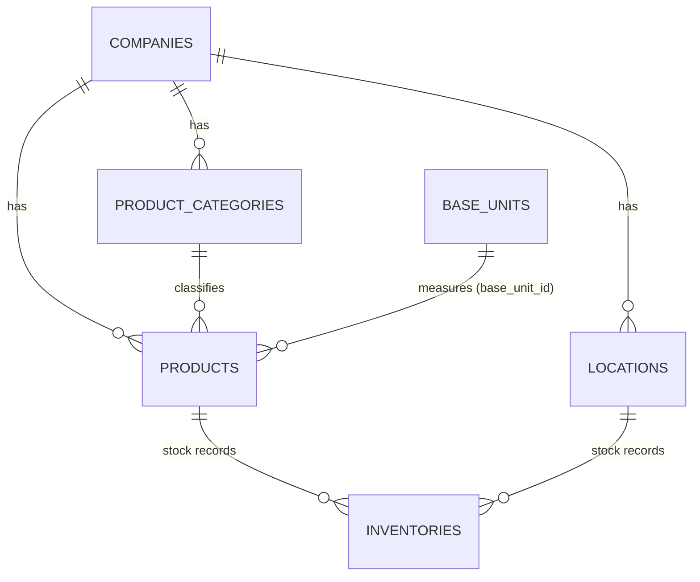

# Inventory Management System — Documentation

A Laravel 13 web application for tracking companies, their product categories, storage locations, products, and the units of measure products are sold in.

This app shares its database with a companion **POS (point-of-sale) application** — see [Companion POS application](#companion-pos-application) in the Developer Guide.

This document has two parts:

- **[Part 1 — User Guide](#part-1--user-guide)** — how to use the application through the browser.
- **[Part 2 — Developer Guide](#part-2--developer-guide)** — how to set up, run, and extend the codebase.

---

## Part 1 — User Guide

### Signing in

- Go to `/login` to sign in, or `/register` to create a new account (name, email, password).
- All pages except the login/register screens require you to be signed in.
- Use **Sign out** in the top-right of the navigation bar to log out.

### Navigation

Once signed in, the top navigation bar gives you access to every module:

| Menu item | What it manages |
|---|---|
| Companies | The organizations that own categories, locations, and products |
| Categories | Product categories, each belonging to a company |
| Locations | Physical/warehouse locations, each belonging to a company |
| Products | The product catalog |
| Base Units | Units of measure (e.g. Kilogram/kg, Piece/pc, Liter/ltr) used by products |
| Stock | Stock levels — how much of each product is on hand at each location |

Each module works the same way: a list page with **New**, **Edit** (pencil icon), and **Delete** (trash icon) actions.

### Companies

- **List**: `/companies` — shows all companies.
- **Create**: click **New Company**, enter a name, save.
- **Edit / Delete**: from the list, use the pencil/trash icons.

Companies are the top-level entity — categories, locations, and products are all tied to one.

### Categories

- **List**: `/categories`.
- **Create**: click **New Category**, choose the owning **Company**, enter a name.
- Used to classify products (e.g. "Electronics", "Beverages").

### Locations

- **List**: `/locations`.
- **Create**: choose the owning **Company**, enter a name and an optional description.
- Represents a place stock can be kept (a warehouse, a shelf, a store branch).

### Products

- **List**: `/products` — shows every product with its company, category, and base unit.
- **Create** (`/products/create`):
  1. Choose a **Company**.
  2. Choose a **Category**.
  3. Enter **Product Name**, optional **Description**, and a unique **SKU** (code).
  4. Enter the **Unit Value / Qty** (defaults to 1).
  5. Click **Browse** next to **Base Unit** to open a picker listing all Base Units, then click **Select** on the one you want.
  6. Enter a **Selling Price** and optional **Cost** — these drive the price shown at checkout in the companion POS app; leave Selling Price at 0 for products not sold through the register.
  7. Save.
- **Edit**: same form, pre-filled with the product's current values.
- **Delete**: from the list page.

### Base Units

- **List**: `/base-units` — shows every unit of measure with its name and short code.
- **Create**: click **New Base Unit**, enter a **Unit Name** (e.g. "Kilogram") and an optional **Code** (e.g. "kg").
- **Edit**: update the name/code.
- **Delete**: if a unit is currently assigned to one or more products, deletion is blocked with a message explaining why — reassign or delete those products first.

### Stock

- **List**: `/inventory` (nav label "Stock") — shows every stock record with its product, location, and quantity.
- **Create**: click **Add Inventory**, choose a **Product**, a **Location**, and enter the **Quantity** on hand.
- **Edit**: update the quantity, or reassign the product/location, from the list's **Edit** action.
- Each product can only have **one** stock record per location — trying to create a second one for the same product+location pair shows a validation message telling you to edit the existing record instead.
- The companion POS app has its own equivalent Stock page (scoped to whichever location a cashier is currently selling from) — both write to the same `inventories` table, so a change made in either app is immediately visible in the other.

---

## Part 2 — Developer Guide

### Tech stack

- **Backend**: Laravel 13, PHP 8.3+
- **Database**: Microsoft SQL Server (`sqlsrv` driver) for local development; tests run against in-memory SQLite (see `phpunit.xml`)
- **Frontend**: Server-rendered Blade views styled with **Bootstrap 5** (loaded via CDN in `resources/views/layouts/app.blade.php`) and Bootstrap Icons. Vite/Tailwind are scaffolded in `package.json` but are not the source of the actual UI styling.
- **Auth**: Laravel's built-in session-based guard (`AuthController`, `Auth::attempt`)

### Requirements

- PHP 8.3+
- Composer
- Node.js (for Vite asset building, optional for basic use)
- SQL Server (with an ODBC Driver 17 for SQL Server) for local dev, or adjust `.env` to use SQLite/MySQL

### Installation & setup

```bash
composer install
cp .env.example .env
php artisan key:generate
```

Edit `.env` and set your database connection. For SQL Server (used in local development):

```
DB_CONNECTION=sqlsrv
DB_HOST=YOUR_HOST\SQLEXPRESS
DB_PORT=
DB_DATABASE=inventory
DB_USERNAME=
DB_PASSWORD=
```

Then run migrations and (optionally) seed sample data:

```bash
php artisan migrate
php artisan db:seed
```

Install frontend dependencies (only needed if you touch `resources/css`/`resources/js`):

```bash
npm install
npm run build
```

### Running the app

```bash
composer run dev
```

This runs `php artisan dev`, which starts the Laravel server, queue listener, and Vite dev server together. Alternatively, `php artisan serve` on its own is enough since the UI doesn't depend on compiled assets.

### Running tests

```bash
composer run test
# or
php artisan test
```

Tests always run against an in-memory SQLite database (forced by `phpunit.xml`), independent of whatever `.env` is configured for local dev — no separate test database setup is needed.

To run a single test:

```bash
php artisan test tests/Feature/ExampleTest.php
php artisan test --filter=test_method_name
```

### Code style

```bash
vendor/bin/pint
```

### Architecture

**Routing & auth** (`routes/web.php`): a `guest` middleware group holds `/login` and `/register`; everything else sits behind an `auth` middleware group and is registered as a standard `Route::resource(...)` per module (`companies`, `products`, `categories` → `ProductCategoryController`, `locations`, `base-units` → `UnitOfMeasureController`). Root `/` redirects to `products.index`.

**Data model:**

| Model | Table | Primary key | Notes |
|---|---|---|---|
| `Company` | `companies` | `company_id` | Non-default PK; has an accessor working around SQL Server column-casing differences |
| `ProductCategory` | `product_categories` | `id` | The live category model — used by `ProductCategoryController` and `ProductController` |
| `Location` | `locations` | `id` | Belongs to a `Company` |
| `Product` | `products` | `id` | Belongs to `Company`, `ProductCategory`, and `UnitOfMeasure` (via `base_unit_id`). Also carries `selling_price`/`cost` — added by the companion POS app's migrations, editable from either app |
| `UnitOfMeasure` | `base_units` | `id` | Despite the class name, its `$table` is overridden to `base_units` — this is the model backing the "Base Units" feature |
| `BaseUnit` | `base_units` | `id` | A second model pointing at the same table as `UnitOfMeasure`; only used to populate the product form's unit picker |
| `Inventory` | `inventories` | `id` | Product + Location + quantity; unique per (product, location) pair. Has two quantity columns, see Known Issues |
| `User` | `users` | `id` | Standard Laravel auth user |



**SQL Server quirks to be aware of:**

- Several models hardcode `company_id` as both the local and foreign key in relationships, since `companies.company_id` isn't the Eloquent-default `id`.
- A cascade delete was deliberately removed from `inventories.location_id` (see migration `2026_08_24_000007_create_inventories_table`) to avoid SQL Server's multiple-cascade-path error.

### Known Issues

- The `inventories` table has two overlapping quantity columns: an original `quantity_on_hand` (from the initial migration) and a later `quantity` (added in `2026_08_25_050010_add_quantity_to_inventories_table`). This app's own `InventoryController` only reads/writes `quantity`. The companion POS app treats whichever column is larger as the true on-hand count (`Inventory::effectiveStock()`) and writes both back in sync on every sale, refund, or stock edit — so in practice both columns stay equal as long as stock changes go through either app's UI, but a record created only through this app's older `db:seed`/tinker paths could still leave `quantity_on_hand` at its default `0` until the next POS-side write touches it.
- Two separate migrations created similarly-named tables early in the project's history — `base_units` and an unrelated, unused `unit_of_measures` table, plus a separate empty `categories` table distinct from `product_categories`. These are historical leftovers; the live features use `base_units` and `product_categories` respectively. See `CLAUDE.md` for the full list of naming quirks to be careful of when extending this codebase.
- There is no company-scoping anywhere in this app — every signed-in user sees every company's data (companies, locations, products, stock). The companion POS app added its own scoping on its side (each POS user is tied to one company via `users.company_id`), but that constraint isn't enforced here.

### Companion POS application

A separate Laravel 13 app (in its own `POS/` project folder) implements a point-of-sale register on top of this same database — same SQL Server connection, same `companies`/`locations`/`products`/`inventories`/`users` tables, no API or sync step between them. It added, via its own migrations:

- `products.selling_price` and `products.cost` (see the Products section above and the Data model table).
- Four new tables it owns exclusively: `sales`, `sale_items`, `refunds`, `refund_items` — this app has no UI for them and doesn't need one.

Because the two apps share one `migrations` table (it's in the shared database), each app's default Laravel migrations are only ever applied once — whichever app runs `php artisan migrate` first "wins", and the other app's migrate skips those same-named files as already run.

Practical implications for anyone working on this codebase:

- **Don't drop or rename `products.selling_price`/`cost`, or the `inventories.quantity`/`quantity_on_hand` columns** without checking the POS app first — it depends on all four.
- A user account is shared: signing up or logging in here uses the exact same `users` row as the POS app, so a password reset or role change here affects both.
- If you add a migration that alters `products`, `inventories`, `locations`, `companies`, or `users`, mention it to whoever maintains the POS app (or check its `DOCUMENTATION.md`) — those tables are load-bearing for checkout, stock deduction, and refunds over there.
